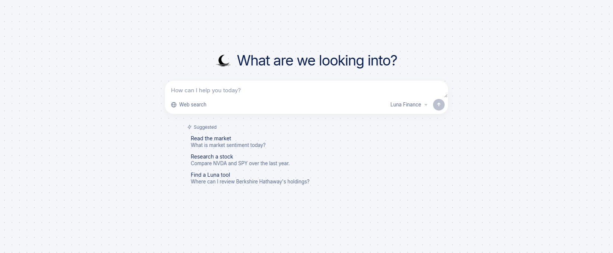
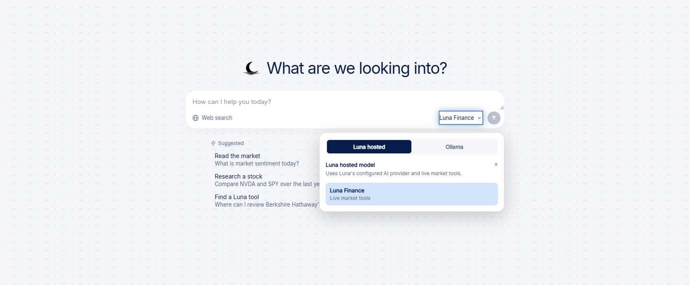
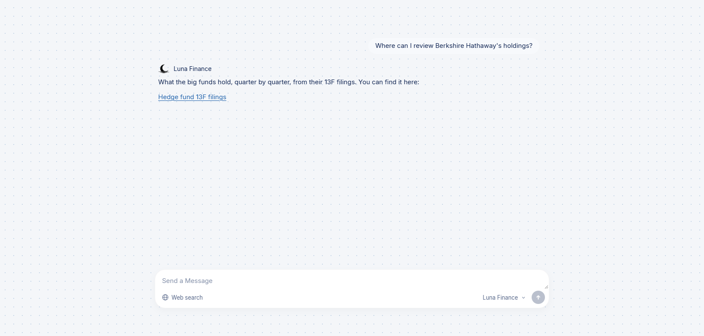
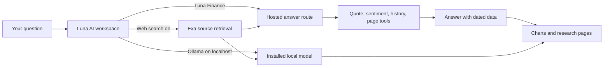
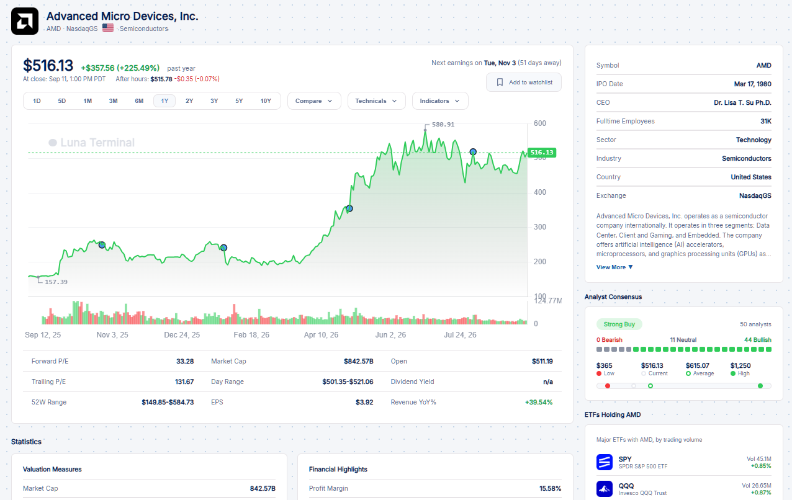

<p align="center">
  
</p>

# Luna Terminal

**A financial research workspace with AI at its center.** Luna brings market sentiment, stocks, portfolios, institutional holdings, news, and company relationships into one place. Ask a question in plain language, inspect the underlying market data, then move into the relevant chart or research tool.

The web app is built with Next.js and React. An Electron desktop shell also supports local chat with Ollama. This repository contains the application source, assets, API routes, and desktop packaging project.



*The AI workspace captured from the application. Market figures in screenshots elsewhere in this README are historical examples, not current quotes.*

## Contents

- [What Luna does](#what-luna-does)
- [AI: the center of the workflow](#ai-the-center-of-the-workflow)
- [Research and market tools](#research-and-market-tools)
- [Screenshots](#screenshots)
- [Run locally](#run-locally)
- [Configuration](#configuration)
- [Desktop app](#desktop-app)
- [Project structure](#project-structure)
- [Data and research boundaries](#data-and-research-boundaries)

## What Luna does

Luna is designed for the path from **market context → company research → evidence → comparison**. A trader can start with the sentiment dashboard, open a stock chart, check earnings and valuation, and review recent reporting. An advisor can compare portfolios, inspect institutional holdings, and organize client research. The AI workspace helps users ask for a number, a comparison, an explanation, or the right page to continue the work.

The public research views are free to open. Some capabilities need a configured feed, AI provider, or account database; the setup table below identifies those dependencies.

### A typical research session

1. Open the [market dashboard](app/dashboard/page.js) to check the sentiment index, market activity, and customizable widgets.
2. Ask Luna, “What is market sentiment today?” or “Compare NVDA and SPY over the last year.”
3. Follow a stock link to review price history, profile, technicals, earnings, and valuation.
4. Explore related tools such as [stock maps](app/maps/page.js), [13F holdings](app/hedge-funds/page.js), or the [supply chain](app/supply-chain/page.js).
5. Use source links and dates to check any news or web research before making a decision.

## AI: the center of the workflow

Luna's chat interface lives at `/dashboard/chat`. It offers suggested questions, streaming responses, searchable browser-stored chat history, stock quote cards with range controls, and a model selector. The default **Luna Finance** connection uses the server's AI route; **Ollama** appears when the site is opened on localhost or from the desktop app. The **Web search** switch can add retrieved sources to either conversation path when Exa is configured.



*Choose the hosted market assistant or a model installed on your computer.*

### Luna Finance: answers backed by market tools

The hosted assistant is implemented in [`app/api/ai-chat/route.js`](app/api/ai-chat/route.js). With an Anthropic API key, Claude plans which tools a question needs, the server fetches their results, and Claude writes a short answer from those results. The first model turn is required to call a tool. For conceptual questions that need no live number, it can call `no_data_needed`.

| Tool | What it retrieves | Why it matters |
| --- | --- | --- |
| `get_quote` | Prices, daily percentage moves, names, and currencies for stocks, ETFs, indices, or supported crypto symbols | Current figures come from a quote feed rather than model memory. |
| `get_market_sentiment` | The latest sentiment score, rating, date, and earlier readings | Puts a market mood question in time and context. |
| `get_history` | A price series, range change, high, and low for a symbol | Supports trend and performance questions with historical data. |
| `find_page` | Relevant routes from Luna's own research catalog | Turns “where can I find…?” into a real site link. |
| `no_data_needed` | A marker for a conceptual question | Lets the assistant explain a term without pretending to fetch a quote. |

The server limits question volume, validates symbols before placing them in data URLs, keeps only a recent slice of conversation, and streams the answer as it arrives. The assistant prompt requires dates for market figures, acknowledges missing feed data, and avoids buy or sell instructions.

**The keyless path is useful too.** [`lib/liloLocal.js`](lib/liloLocal.js) can answer a narrower set of questions using Luna's own data: current quote requests, the latest market sentiment reading, and navigation to a relevant research page. It runs when no Anthropic key is configured and serves as a fallback when a model call fails before an answer starts. Open-ended questions need a configured AI provider or a local model.



*A real keyless response: Luna points a holdings question to the relevant research view.*

### Ollama: private local chat

On `localhost` or in the desktop shell, the model selector discovers chat models installed in Ollama. Browser chat connects directly to `http://127.0.0.1:11434`; the desktop app uses its isolated native bridge. No Luna account or AI API key is needed for this path.

Local chat is separate from Luna Finance's market tools. An Ollama model does **not** automatically know current prices or have access to Luna's quote and sentiment functions. It can use the optional Web search excerpts supplied in the conversation, with source links and dates, when that service is configured.

### Web research with visible sources

The **Web search** toggle calls [`/api/ai-research`](app/api/ai-research/route.js), which uses Exa when `EXA_API_KEY` is present. The app retrieves up to six results, records when it retrieved them, passes excerpts to the selected model as untrusted evidence, and displays clickable source links below the answer. The research prompt tells the model to distinguish publication time from retrieval time and to say when evidence is insufficient.

The same research layer supports evidence for supply-chain relationships. Recent stock news and catalyst context use Finnhub when configured. A source published near a price move provides context; timing alone does not establish causation.



### Questions Luna is built to handle

| Ask | What Luna uses |
| --- | --- |
| “How is the market feeling today?” | The current sentiment reading and historical context. |
| “What is AMD trading at?” | A quote lookup and a route to AMD's stock page. |
| “How did NVDA perform over the last year?” | Historical price data for the requested range. |
| “Where can I see Berkshire Hathaway's holdings?” | Luna's page catalog and the 13F view. |
| “What does P/E mean?” | A conceptual explanation with no price lookup required. |
| “What reporting discusses this supplier relationship?” | Web research with source links when Exa is configured. |

## Research and market tools

Luna combines conversational entry with dedicated views for deeper analysis.

| Area | What you can do | Main route |
| --- | --- | --- |
| Market dashboard | Monitor sentiment, events, popular stocks, watchlists, and up to four arranged research widgets. | `/dashboard` |
| Stock research | Inspect a company's quote, chart, profile, technicals, earnings, valuation, and related context. | `/stock/[symbol]` |
| Stock screener | Filter stocks by market cap, valuation, performance, and technical measures. | `/screener` |
| Maps | Explore market performance as treemaps and force-layout views. | `/maps` |
| Institutional holdings | Review managers' public 13F positions and quarterly changes. | `/hedge-funds` |
| Supply chain | Explore supplier, customer, and other company relationships as a flow diagram; request supporting sources where available. | `/supply-chain` |
| Earnings and events | Look up scheduled earnings, implied moves, and upcoming market events. | `/earnings-calendar` |
| Portfolio comparison | Compare portfolio or ticker growth on the same view. | `/portfolio-comparison` |
| Quantitative views | Use chart metrics, historical comparisons, and regression analysis. | `/chart-metrics`, `/regression-analysis` |
| Personal workspace | Manage a watchlist, alerts, and advisor client records with a configured account database. | `/watchlist`, `/alerts`, `/finance-crm` |
| RSI strategy lab | Explore RSI strategy settings and backtest results in a password-gated lab. | `/ai-bot` |

The `/ai-bot` path is a legacy route name for the RSI lab. The conversational AI workspace is at `/dashboard/chat`.

## Screenshots

### Stock research in context



*Captured stock page showing the chart, company profile, analyst consensus, and ETF context. The displayed prices are from the capture, not a live feed in this README.*

### Luna identity

<p align="center">
  
  &nbsp;&nbsp;&nbsp;
  
</p>

The site also has an animated welcome experience at `/about`; its artwork and video are in [`public/welcome`](public/welcome).

## Run locally

### Web app

You need Node.js, npm, and a network connection for live market feeds. Start with the repository source:

```bash
git clone https://github.com/Darthh/Luna-LPL11.git
cd Luna-LPL11
npm ci
cp .env.local.example .env.local
npm run dev
```

Open `http://localhost:3000/about` for the introduction, `http://localhost:3000/dashboard` for market views, or `http://localhost:3000/dashboard/chat` for AI. Fill in only the environment values needed for the capabilities you plan to use. Keep `.env.local` private; it is ignored by Git.

If you want private local chat, install Ollama separately, start it, and download a chat model:

```bash
ollama pull llama3.2
```

In the AI workspace, open the model selector, choose **Ollama**, refresh models, and select the installed model. Use the `localhost` address shown above. Browser origin restrictions may require adding your exact local site origin to `OLLAMA_ORIGINS` and restarting Ollama. Local chat does not require `ANTHROPIC_API_KEY`.

Accounts and personal data features require a PostgreSQL connection in `DATABASE_URL`, `AUTH_SECRET`, and a database schema matching [`prisma/schema.prisma`](prisma/schema.prisma). This repository snapshot includes the schema but no Prisma migration directory; provision the database schema for your environment before using sign-in, watchlists, alerts, or advisor records. Google sign-in also needs the optional Google OAuth variables below.

## Configuration

The template is [`.env.local.example`](.env.local.example). Never put real provider values into the README, issues, or commits.

| Variable | Enables | Required for a basic local UI? |
| --- | --- | --- |
| `ANTHROPIC_API_KEY` | Open-ended Luna Finance answers through Claude. | No; the hosted route has narrower keyless answers. |
| `ANTHROPIC_WORKSPACE_ID` | Workspace header for an organization-level Anthropic key. | No. |
| `AI_BOT_MODEL` | Override for the hosted Claude model. | No. |
| `EXA_API_KEY` | AI Web search and source-backed supply-chain research. | No. |
| `FINNHUB_API_KEY` | Recent stock news, catalysts, supply-chain articles, and earnings fallback data. | No. |
| `TWELVEDATA_API_KEY` | Additional market-data coverage used by the app. | No. |
| `ALPHAVANTAGE_API_KEY`, `FMP_API_KEY`, `POLYGON_API_KEY` | Optional earnings, estimates, or financial-data fallbacks. | No. |
| `DATABASE_URL`, `AUTH_SECRET` | Email/password accounts and saved account data. | No for public views; yes for account features. |
| `AUTH_GOOGLE_ID`, `AUTH_GOOGLE_SECRET` | Optional Google sign-in. | No. |
| `RESEND_API_KEY`, `ALERT_FROM_EMAIL`, `CRON_SECRET` | Scheduled sentiment email alerts. | No. |

Market feeds can throttle or be unavailable. Some pages show a reduced view or a configuration message when an optional provider is missing.

## Desktop app

The [`desktop`](desktop) directory contains an Electron shell for Windows and macOS. It presents a local workspace, links to the hosted dashboard, and bridges only bounded Ollama model listing and chat. Model weights are not bundled. Local conversations are held in memory in the desktop shell, while web chat history is stored in the browser's local storage.

```bash
npm ci --prefix desktop
npm start --prefix desktop
```

See [desktop/README.md](desktop/README.md) for packaging targets, installer names, and signing requirements.

## Project structure

| Path | Role |
| --- | --- |
| [`app`](app) | Next.js pages and API routes. |
| [`components`](components) | Dashboard, AI workspace, charts, maps, and research interfaces. |
| [`lib`](lib) | Market-data adapters, AI retrieval and fallback logic, calculations, and shared utilities. |
| [`prisma`](prisma) | Database schema for accounts and saved user data. |
| [`public`](public) | Brand assets, screenshots, welcome media, and static data. |
| [`desktop`](desktop) | Electron app and Ollama bridge. |
| [`scripts`](scripts) | Data preparation and project maintenance scripts. |

The web stack uses Next.js 16, React 19, Chart.js, Auth.js, Prisma, and PostgreSQL. The AI paths use Anthropic for optional hosted generation, Ollama for local models, and Exa for optional web retrieval. Finnhub and other market feeds support research views when configured.

## Data and research boundaries

- A current price, market move, or sentiment reading depends on its feed and the timestamp returned with it. A model's general knowledge is not a quote source.
- Web search supplies links and excerpts for investigation. Luna treats retrieved material as evidence to assess, not instructions to execute or proof that a nearby news item caused a market move.
- Local Ollama chat can run without a Luna AI key, but it has no built-in access to Luna Finance's live market tools.
- Public 13F filings report positions after the filing delay; they are not a live view of a fund's holdings.
- Luna is research software. It provides information and analysis, not personalized investment advice or trade execution.

For the complete usage and data policies, see the application's [Terms](app/%28legal%29/terms/page.js) and [Privacy](app/%28legal%29/privacy/page.js) pages.
