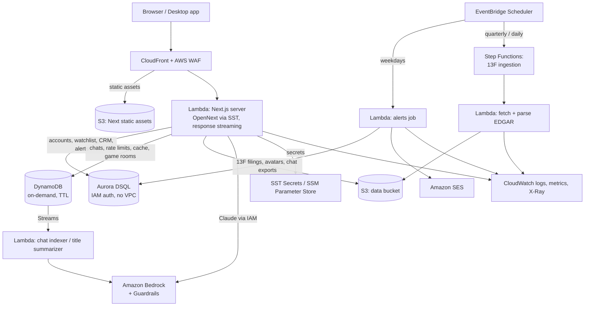

# Luna Terminal — Backend & AWS Plan

Status: **in progress** — Phases 0–2 done, 3 mostly done, 4 led by `main` · Branch: `backend-aws-plan` · Last updated: 2026-10-03

This document is the working plan for turning Luna's backend into something
that runs properly on AWS, persists user data (starting with AI chat
history), and makes a strong entry for the **"Best use of AWS"** track. It
is written so several people can work in parallel without stepping on each
other — in particular the person currently building **saved chat history**
(see [§4](#4-chat-history--the-contract-to-agree-on-first)).

---

## 1. Where we are today

### 1.1 What exists

| Layer | Today | Notes |
|---|---|---|
| Web app | Next.js 16 (App Router), React 19 — ~40 pages, 47 API routes | Builds cleanly (`next build`). `proxy.js` is the Next 16 middleware. |
| Auth | Auth.js v5, JWT sessions, Prisma adapter, email/password + optional Google | `auth.config.js` (edge-safe) + `auth.js` (with adapter). |
| Database | Prisma 7 + `@prisma/adapter-pg`, **static `DATABASE_URL`** (`lib/prisma.js`) | Schema: `User`, `Account`, `Session`, `WatchlistItem`, `AdvisorClient`, `FearGreedAlert`, `ClipSnapshot`, `ApiKey`, Forum*. Hand-written SQL in `migrations/`. |
| AI chat | `app/api/ai-chat/route.js` — Anthropic SDK, 2-turn tool plan → streamed answer; keyless fallback `lib/liloLocal.js`; Ollama on localhost; Exa web research | Default model Haiku 4.5. |
| Chat history | **Browser `localStorage` only** (`lib/chatHistory.js`, 30 chats max) | Lost across devices/browsers; not tied to the account. |
| Caching | In-process `lib/memo.js` + CDN cache headers | Per-instance; cold on every Lambda. |
| Rate limiting | In-process `lib/rateLimit.js` | Per-instance — ineffective on Lambda. |
| 13F filings cache | `lib/filingStore.js` → **stub returning `null`** | Every holdings view re-fetches/re-parses EDGAR. |
| Avatars | Data-URIs in `User.image` (≤200 KB) | No object storage. |
| Game rooms | In-process `Map` (`app/api/game-room`) | Breaks with >1 instance. |
| Scheduled jobs | `/api/cron/alerts` expects a bearer `CRON_SECRET` from "a scheduler" | Comments reference `lambda/alerts.ts`, which doesn't exist. |
| Email | Resend over `fetch` (`lib/sendEmail.js`) | |
| Bot check | Cloudflare Turnstile on signup | Left over from the Cloudflare era. |
| Desktop | Electron shell + Ollama bridge | Separate; out of scope here. |
| CI | Only a manual desktop build workflow | Nothing checks the web app on push/PR. |

### 1.2 The core inconsistency

`AGENTS.md`, `prisma.config.mjs`, `next.config.mjs` and several comments
describe an **SST → Lambda + CloudFront, Aurora DSQL, S3, Bedrock,
EventBridge** deployment. None of that infrastructure is in the repo:
`sst.config.ts`, `scripts/dsql-migrate.mjs` and `lambda/alerts.ts` are
missing, and `lib/prisma.js` uses a plain password URL. This plan **commits
to that AWS target** and builds it for real.

### 1.3 Health baseline (2026-10-02)

- `next build` ✅ · `node --test lib/*.test.mjs` ✅ 38/39 (1 skipped)
- `scripts/test-*.mjs`: 31 pass, 3 fail — `test-fund-return` (imports a
  removed `estimatedYtd` export), `test-markdown-negotiation` and
  `test-yahoo-quote` (both hit the live network).
- `eslint`: 8 errors, all `react-hooks/set-state-in-effect`.

---

## 2. Goals and non-goals

**Goals**

1. Every signed-in user's data (chats, watchlist, alerts, CRM, profile)
   lives server-side, is isolated per user, and survives devices/redeploys.
2. One-command, reproducible deploys to AWS via infrastructure-as-code, with
   per-developer preview stages.
3. No state that silently breaks when Lambda runs >1 instance (rate limits,
   caches, game rooms).
4. AI runs on AWS (Bedrock) with IAM, not a long-lived API key — and keeps
   working keyless when nothing is configured.
5. A demo-able architecture that uses AWS services *because they fit*, not
   for logo count — that is what wins a "best use of AWS" track.

**Non-goals (for now)**

- Rewriting auth onto Cognito (see [§9](#9-decisions-considered-and-rejected)).
- Real-time multi-user features beyond the existing game room.
- Rewriting the front end; the chat UI work stays with its owner.

---

## 3. Target architecture

### 3.1 Service-by-service rationale

| Need | AWS service | Why this one |
|---|---|---|
| Host Next.js | **Lambda + CloudFront via SST (`sst.aws.Nextjs`, OpenNext)** | Scale-to-zero, response streaming for chat, CDN in front of the existing cache headers. The codebase already assumes it (`next.config.mjs` trims PGlite for cold starts). |
| Relational account data | **Aurora DSQL** | Serverless Postgres-compatible, no VPC/NAT (cheap and fast cold starts from Lambda), IAM-token auth (no password secret), multi-region capable. Existing code comments already target it. |
| Chat history, rate limits, caches, game rooms | **DynamoDB (on-demand)** | Key-value access patterns, item TTL for free expiry, atomic counters for rate limits, Streams for async processing. Avoids DSQL's per-transaction row limits and lack of JSON column types for chat payloads. |
| Filings, avatars, exports | **S3** | Immutable, write-once objects (a filed 13F never changes). Presigned uploads for avatars instead of data-URIs. |
| LLM | **Amazon Bedrock** (Claude) | IAM role on the Lambda — no API key in config; this is the "keyless AI tier" `AGENTS.md` describes. Keep the first-party Anthropic key as an optional override. |
| Safety | **Bedrock Guardrails** | Enforces "no personalised investment advice" and PII filtering at the platform layer, in addition to the prompt. |
| Scheduled jobs | **EventBridge Scheduler** | Replaces "a provider-neutral scheduler with a bearer token". Invokes a Lambda directly — no public cron URL. |
| Multi-step ingestion | **Step Functions** | 13F ingestion is fetch → parse → aggregate → publish with retries per manager; today it's hand-run `scripts/build-hedge-*.mjs`. |
| Email | **Amazon SES** | Native to the account, IAM-authorised; Resend stays as a fallback adapter. |
| Bot protection | **AWS WAF** (rate-based rules + CAPTCHA/Bot Control on `/api/auth/*`) | Replaces Cloudflare Turnstile, which is a leftover from the old host. |
| Secrets | **SST `Secret` (SSM Parameter Store)** | Finnhub/Exa/Tradier keys etc. per stage. |
| Observability | **CloudWatch + X-Ray** (Powertools-style structured logs), **AWS Budgets** alarm | Cost and latency visibility for the demo and for us. |
| CI/CD | **GitHub Actions → AWS via OIDC** | No long-lived AWS keys in GitHub. |

---

## 4. Chat history — the contract to agree on first

Someone is already building "save old chats". To avoid two incompatible
implementations, **agree on this contract before either side writes more
code.** The front end codes against a client module and an HTTP API; the
backend can change storage without the UI noticing.

### 4.1 Behaviour

- **Signed out:** unchanged — chats stay in `localStorage` via
  `lib/chatHistory.js`.
- **Signed in:** chats are stored server-side and listed from the server.
- **On first sign-in:** local chats are imported once (idempotent), then
  the local copy is cleared or marked synced.
- Both hosted (Luna Finance) and Ollama chats are saved the same way — the
  **client** persists, because Ollama answers never touch our server.

### 4.2 Client side — ✅ implemented as background sync

Instead of a new async store the UI would have to be rewritten around,
`lib/chatHistory.js` keeps the browser copy as the UI's source and syncs it:

- `saveChat()` also POSTs the whole conversation to
  `/api/chats/:id/messages` in the background (the server keeps only new
  messages, so this also catches up after a failed save).
- `deleteChat()` also DELETEs the server copy.
- `syncChats()` — called once by the sidebar (`TerminalNav.jsx`) — pulls the
  account's recent chats the browser is missing or behind on, and uploads
  local chats the server lacks (`/api/chats/import`).
- A 401 (signed out) or 503 (no store) turns syncing off for the page load.

`AIWorkspace.jsx` is unchanged. Verified in a real browser: a chat sent on
one signed-in browser shows up in a second, fresh browser's sidebar.

### 4.3 HTTP API (backend owner) — ✅ implemented

Code: `app/api/chats/**`, `lib/chatApi.js` (session, rate limit, errors),
`lib/chats.mjs` (validation), `lib/chatRepository.mjs` (stores). Tests:
`lib/chatRepository.test.mjs` runs one suite against both stores.

All routes require a session; every key is scoped to `session.user.id`,
never a client-supplied user id, so two users with the same chat id never
collide.

| Method & path | Body / query | Returns |
|---|---|---|
| `GET /api/chats` | `?cursor=&limit=20&q=` (limit ≤ 50) | `{ chats: [{ id, title, createdAt, updatedAt, messageCount, pinned }], cursor }` newest first; `cursor: null` at the end |
| `GET /api/chats/:id` | — | `{ id, title, createdAt, updatedAt, messageCount, pinned, messages }` or 404 |
| `POST /api/chats/:id/messages` | `{ title?, from?, messages: [{ role, content, sources?, stockCard?, model? }] }` | `201` (created) / `200` `{ ok, messageCount, created }` |
| `PATCH /api/chats/:id` | `{ title?, pinned? }` | `{ ok }` or 404 |
| `DELETE /api/chats/:id` | — | `204` or 404 |
| `POST /api/chats/import` | `{ chats: [...] }` — exactly what `lib/chatHistory.js` stores | `{ imported, unchanged, skipped }` |

**Saving is position-based and idempotent.** A message's identity is its
index in the conversation. `from` is the index of `messages[0]` (default 0),
so the simplest client just sends the **whole history** after every answer —
exactly what `saveChat()` does today — and the server writes only the indexes
it doesn't have. A retry or a double-send is harmless. If `from` is past
what's saved, the answer is **409 `{ messageCount }`**: resend from there.

Other answers: `400` validation (message names the field), `401` signed
out, `404` unknown id *or another user's chat* (indistinguishable on
purpose), `429` rate limited (`Retry-After`), `503` chat sync not
configured — **the client should then keep using `localStorage`**.

Limits: chat id `^[A-Za-z0-9_-]{6,64}$` (today's `Date.now()` ids and UUIDs
both fit); `role ∈ {user, assistant}`; content ≤ 32 000 chars; ≤ 500
messages per chat; ≤ 10 sources; `sources`/`stockCard` ≤ 16 000 chars of
JSON; title ≤ 120 chars (defaults to the first user message, 60 chars).
Unknown message fields (e.g. `error`) are dropped. Search matches the title
and the user's own messages.

Which store runs: `CHAT_TABLE` set → DynamoDB; otherwise in-memory in
`next dev` (lost on restart; set `CHAT_STORE=memory` to force it), and
**no store (503) in production** so nothing pretends to persist.

### 4.4 Storage (DynamoDB, single table `LunaData`) — ✅ implemented

| Item | PK | SK | Attributes |
|---|---|---|---|
| Chat summary | `USER#<userId>` | `CHAT#<chatId>` | `title, searchText, createdAt, updatedAt, messageCount, pinned` + `GSI1PK=USER#<userId>`, `GSI1SK=UPD#<updatedAt>#<chatId>` |
| Message | `CHAT#<userId>#<chatId>` | `MSG#<000123>` | `index, role, content, sources, stockCard, model` |

Table needs `PK`/`SK` (strings) and a `GSI1` index on `GSI1PK`/`GSI1SK`
with `ALL` projection (the SST definition in Phase 2 creates it).

- Append writes each new message with a conditional put (never overwrites),
  *then* advances `messageCount` with a conditional update that only grows.
  A crash in between leaves extra messages that reads ignore, never a gap.
  No transactions needed.
- `DELETE` removes the summary first (the chat vanishes at once), then batch-
  deletes its messages.
- Search v1 filters summaries in code (≤ 500 read per search). v2: Bedrock
  embeddings (see §7).

**If the chat owner has already modelled chats in Prisma/Postgres**, that is
acceptable — keep the API in §4.3 identical and note DSQL constraints:
store `sources`/`stockCard` as `TEXT` (JSON-encoded), no foreign keys (use
Prisma `relationMode = "prisma"`), and keep each append to one small
transaction. The API contract is what matters; storage can move later.

### 4.5 Server-side improvements to the chat route

- Persist hosted answers from the server too (optional), so a closed tab
  mid-stream doesn't lose the answer.
- Load conversation history from storage by `chatId` instead of trusting the
  client-sent history (prevents history tampering and shrinks requests).
- Generate a short chat title asynchronously (DynamoDB Stream → Lambda →
  a small Haiku call) instead of truncating the first message to 60 chars.

---

## 5. Data layer work items

### 5.1 Aurora DSQL for relational data

1. **`lib/prisma.js`**: build the `pg` pool with an IAM token from
   `@aws-sdk/dsql-signer` (token minted per connection; `password` can be
   an async function in `node-postgres`). Fall back to `DATABASE_URL` when
   `DSQL_ENDPOINT` is unset, so local dev keeps using Docker Postgres.
2. **Schema compatibility pass** (verify each item against current DSQL docs
   at the time of implementation — the service is evolving):
   - No foreign-key constraints → `relationMode = "prisma"` and app-side
     cascade deletes (User → Account/Session/Watchlist/Alerts/Clients).
   - Secondary indexes on existing tables → `CREATE INDEX ASYNC`.
   - One DDL statement per transaction → apply with
     `scripts/dsql-migrate.mjs` (to be written: reads `migrations/*.sql`,
     splits statements, records applied files in a `_migrations` table).
   - Optimistic concurrency → retry wrapper for serialization errors
     (`ClipSnapshot` already uses compare-and-swap).
3. Generate SQL with `prisma migrate diff`, review, commit to `migrations/`.
4. Decide fate of unused models (`Forum*`, `ApiKey`, `ClipSnapshot` for GEX
   history — the latter may move to DynamoDB with TTL).

### 5.2 DynamoDB for high-churn / ephemeral state

| Use | Key design | TTL |
|---|---|---|
| Chat history | §4.4 | none (user-owned) |
| Rate limiter (`lib/rateLimit.js`) | `PK=RL#<key>#<window>` with `ADD count 1` + condition | window end |
| Shared response cache (`lib/memo.js` L2) | `PK=CACHE#<route>#<hash>` | per-entry TTL |
| Game rooms (`app/api/game-room`) | `PK=ROOM#<code>` with version attribute | 6 h |
| GEX snapshots (optional move from `ClipSnapshot`) | `PK=GEX#<symbol>`, `SK=<t>` | retention window |

Keep the existing function signatures (`checkRateLimit`, `memo`) and make
the store pluggable: in-memory when no table is configured (local dev,
tests), DynamoDB in AWS.

### 5.3 S3

- **`lib/filingStore.js`**: implement `get/put` against a `filings/` prefix
  — the calling code in `lib/thirteenF.js` is already written for it.
- **Avatars**: presigned PUT from `/api/profile`, store the object key on
  `User.image`, serve through CloudFront. Migrate existing data-URIs lazily.
- **Chat export**: `GET /api/chats/:id/export` → markdown/JSON to S3 →
  presigned download link.

---

## 6. Jobs and pipelines

1. **Alerts** — `lambda/alerts.ts`: EventBridge Scheduler (weekdays, after
   US close) invokes it directly; it reuses `lib/fearGreedAlerts.js` and
   `lib/sendEmail.js` (SES adapter). Keep the HTTP route for manual runs,
   still behind `CRON_SECRET`.
2. **13F ingestion** — Step Functions state machine: list managers → Map
   state (concurrency ~5, EDGAR is rate-limited) → fetch + parse → write to
   S3 → aggregate (`scripts/build-hedge-aggregate*.mjs` logic) → publish
   JSON the pages read. Scheduled daily during filing season, weekly
   otherwise.
3. **Stock universe / ETF CUSIPs** (`scripts/build-stock-universe.mjs`,
   `build-etf-cusips.mjs`) — same pattern, lower frequency.
4. **Chat indexer** — DynamoDB Stream on chat items → title generation and
   (later) embeddings.

---

## 7. AI on AWS

**Done on `main` (teammate):** a hosted-model picker (`lib/hostedModels.mjs`)
with GPT-5.6 Sol (default), Claude Opus 5, Llama 4 Maverick (Bedrock
Converse), Qwen3 and Gemma 4 (Bedrock Mantle, SigV4), Gemini (Google key)
and the key-based Luna Finance — all sharing the same market tools
(`lib/awsChat.mjs`). IAM is scoped to exactly those models in
`sst.config.ts`. Details and what the workshop account allows:
`docs/AWS_AI_PREVIEW.md`.

Next:
1. **Prompt caching** on the system prompt and tool list. For Converse that
   is a `cachePoint` block; for Anthropic-shaped requests, explicit
   `cache_control` breakpoints (Bedrock doesn't take the top-level field).
2. **Guardrails**: a Bedrock Guardrail (denied topic: personalised buy/sell
   advice; PII masking) applied to Converse calls via `guardrailConfig`.
3. **Usage metering**: log token `usage` per request as CloudWatch EMF
   metrics by model — cost per model is a strong AWS-track chart.
4. **More tools** (from the preview doc): ETF holdings, 13F filings,
   fundamentals, supply chain — the library functions already exist.
5. **Stretch**: Bedrock Knowledge Base over parsed 13F filings in S3, as a
   `search_filings` tool with citations.

## 8. Security, reliability, cost

- **IAM least privilege** per function: the web Lambda gets DSQL
  `DbConnect` (not admin), DynamoDB on `LunaData` only, S3 on the data
  bucket only, Bedrock `InvokeModel*` on named models.
- **WAF**: managed common rule set, rate-based rule on `/api/ai-chat` and
  `/api/auth/*`, CAPTCHA on signup (replacing Turnstile).
- **Input validation** on every new route (sizes, enums, ids); ownership
  checks via session only.
- **Data deletion**: "delete my account" removes DSQL rows, DynamoDB chat
  partitions and S3 objects — needed for the Privacy page's promises.
- **Backups**: DSQL is managed; enable DynamoDB PITR; S3 versioning on the
  data bucket.
- **Cost guardrails**: AWS Budgets alarm per stage; DynamoDB on-demand;
  Lambda memory tuned with real traces; CloudFront caching for public
  market routes (they already send cache headers).
- **Observability**: structured JSON logs with request id + user id hash,
  X-Ray traces for upstream feed latency, a CloudWatch dashboard (p95 chat
  latency, Bedrock tokens, feed error rate, 5xx).

---

## 9. Decisions considered and rejected

| Option | Why not (for now) |
|---|---|
| Cognito instead of Auth.js | Auth.js already works with JWT sessions and Google; migrating users and UI is churn with no user-visible gain. Revisit if we need MFA/SAML. |
| Aurora Serverless v2 (Postgres) + RDS Proxy | Needs a VPC → NAT gateway cost and slower Lambda cold starts. DSQL avoids both. |
| Everything in DynamoDB | Watchlist/CRM/alerts are relational and already modelled in Prisma; rewriting them is not worth it. |
| Everything in DSQL (incl. chats, rate limits) | Rate-limit counters and caches want TTL + atomic increments; chats want cheap append and per-user partitions. DynamoDB fits both. |
| ElastiCache/Redis for cache & rate limits | Needs a VPC; DynamoDB TTL + conditional writes covers our volume. |
| API Gateway WebSockets for game room | Turn-based relay works with polling over DynamoDB; revisit only if latency matters. |

---

## 10. Phased roadmap

Each phase ends with something deployable and demoable. Owners are
placeholders — fill in.

### Phase 0 — Foundations (½–1 day) · ✅ done on `backend-aws-plan`
- [x] Web CI workflow (`.github/workflows/web-ci.yml`): `npm ci`, lint,
      `npm test`, `next build` on every PR and push to `main`.
- [x] Fix `test-fund-return`; network tests skipped unless
      `LUNA_NETWORK_TESTS=1`.
- [x] `npm test` (`scripts/run-tests.mjs`); lint errors 8 → 0.
- [ ] Remove stale Cloudflare/Worker comments; update `AGENTS.md` to match
      reality as it lands.

### Phase 1 — Chat contract & local backend (1–2 days) · owners: chat FE + backend
- [ ] Confirm §4 with whoever owns chat UI next (no one had started it on
      `main` as of 2026-10-03).
- [x] `/api/chats/*` routes behind a repository with memory + DynamoDB
      stores (BE).
- [x] Tests for validation, ownership, idempotent append, gaps, search,
      pagination, import — against both stores (DynamoDB via `dynalite`).
- [x] Front end: background sync in `lib/chatHistory.js` (§4.2), verified in
      a real browser across two sessions.

### Phase 2 — AWS skeleton with SST (1–2 days) · ✅ done on `backend-aws-plan` (not yet deployed)
- [x] `sst.config.ts` (SST v4): `Nextjs` site, `Dynamo` table `LunaData`
      (+GSI1, TTL `expiresAt`, PITR/deletion protection in prod), `Bucket`
      `LunaFiles`, `Dsql` cluster `LunaDb`, all linked; third-party keys as
      `sst.Secret`s. How-to: `docs/DEPLOY.md`.
- [x] `lib/prisma.js` connects to DSQL with per-connection IAM tokens when
      `DSQL_ENDPOINT` is set; local dev keeps `DATABASE_URL`.
- [x] Per-developer stages, `staging`, `production` (retained + protected).
- [x] `.github/workflows/deploy.yml`: OIDC deploy (main → staging, `v*` tag →
      production); skipped until `AWS_DEPLOY_ROLE_ARN` is set.
- [x] Verified offline: config type-checks against SST's platform types;
      OpenNext 3.9.14 packages the app; the packaged Lambda handler serves
      `/api/chats` against a local DynamoDB (dynalite) with production
      cookies.
- [ ] First real `sst deploy` — needs an AWS account (see open questions).

### Phase 3 — Data on AWS · 🟡 mostly done on `backend-aws-plan`
- [x] DSQL cluster, DynamoDB table and S3 bucket in SST behind
      `LUNA_DATA=true` (the default deploy stays the AI preview).
- [x] `scripts/dsql-migrate.mjs` (`npm run db:migrate:dsql`): one statement
      per transaction, drops FKs, `CREATE INDEX ASYNC`, resumable ledger.
      Schema uses `relationMode = "prisma"`; `0003_relation_indexes.sql`
      indexes the relation columns. Verified on Postgres: migrated schema
      matches Prisma; register → sign-in → watchlist → chats work with no FKs.
- [x] `/api/chats` on DynamoDB in AWS stages (`CHAT_TABLE`).
- [x] Shared rate limiter: one atomic DynamoDB counter per key/window
      (`RATE_LIMIT_TABLE`), memory fallback — closes the "per-process
      limiter" gap the AI preview doc flags for the paid AI routes.
- [ ] Run the migration against a real DSQL cluster (needs AWS).
- [ ] `memo` L2 cache and game rooms on DynamoDB.
- [ ] S3 `filingStore`; presigned avatar uploads.

### Phase 4 — AI on Bedrock · 🟡 multi-model chat done on `main`
- [x] Bedrock chat with model picker, scoped IAM (teammate, see §7).
- [ ] Prompt caching, Guardrail, usage metrics, more tools (§7).
- [ ] Server-side history load by `chatId`; async titles via DynamoDB Streams.

### Phase 5 — Jobs (2 days)
- [ ] EventBridge Scheduler → alerts Lambda → SES.
- [ ] Step Functions 13F ingestion → S3.

### Phase 6 — Hardening & showcase (1–2 days)
- [ ] WAF rules, replace Turnstile; account deletion across stores.
- [ ] CloudWatch dashboard, X-Ray, Budgets alarm.
- [ ] Load test chat + map routes; trace with chrome-devtools per `AGENTS.md`.
- [ ] Architecture diagram + demo script for the AWS track (§11).

Stretch: Bedrock Knowledge Base / `search_filings` tool, semantic chat
search, multi-region DSQL.

---

## 11. "Best use of AWS" track — what to show

Judges reward services chosen for a reason and a story that holds together:

1. **Serverless end to end, zero VPC** — CloudFront → Lambda (streaming) →
   DSQL/DynamoDB/S3/Bedrock, all IAM-authenticated: no database password,
   no AI API key, nothing in a `.env` in production.
2. **Right store for each shape of data** — DSQL for relational accounts,
   DynamoDB for chat/time-series/ephemeral state with TTL, S3 for immutable
   filings. Show the access-pattern table (§5.2).
3. **Grounded, governed AI** — Bedrock Claude calls our own market tools;
   Guardrails enforce "no personalised advice"; token usage is metered in
   CloudWatch.
4. **Event-driven pipelines** — EventBridge → alerts; Step Functions fan-out
   over SEC filings; DynamoDB Streams → async titling/indexing.
5. **Operable** — IaC (SST), per-dev stages, OIDC deploys, dashboard,
   budget alarm. Show `sst deploy` reproducing the stack.

Demo script (3 min): sign in → ask "How did NVDA do this year vs SPY?"
(streamed, grounded answer) → open the chat on a second device (server
history) → show the fund holdings page loading from S3 cache → show the
CloudWatch dashboard and the Step Functions run graph.

---

## 12. Open questions

1. Can the workshop account create DynamoDB tables and a DSQL cluster? If
   not, `LUNA_DATA=true` needs another account (the AI preview runs either way).
2. Is the workshop account long-lived enough for the demo, or should the
   demo stage live in a team-owned account?
3. Track deadline — decides whether Phase 5 (jobs) or §7 Guardrails/metering
   come first. Recommendation: Guardrails + metering (cheap, visible) first.
4. Are `Forum*` and `ApiKey` models still wanted? They cost nothing, but they
   are schema the migration carries.
