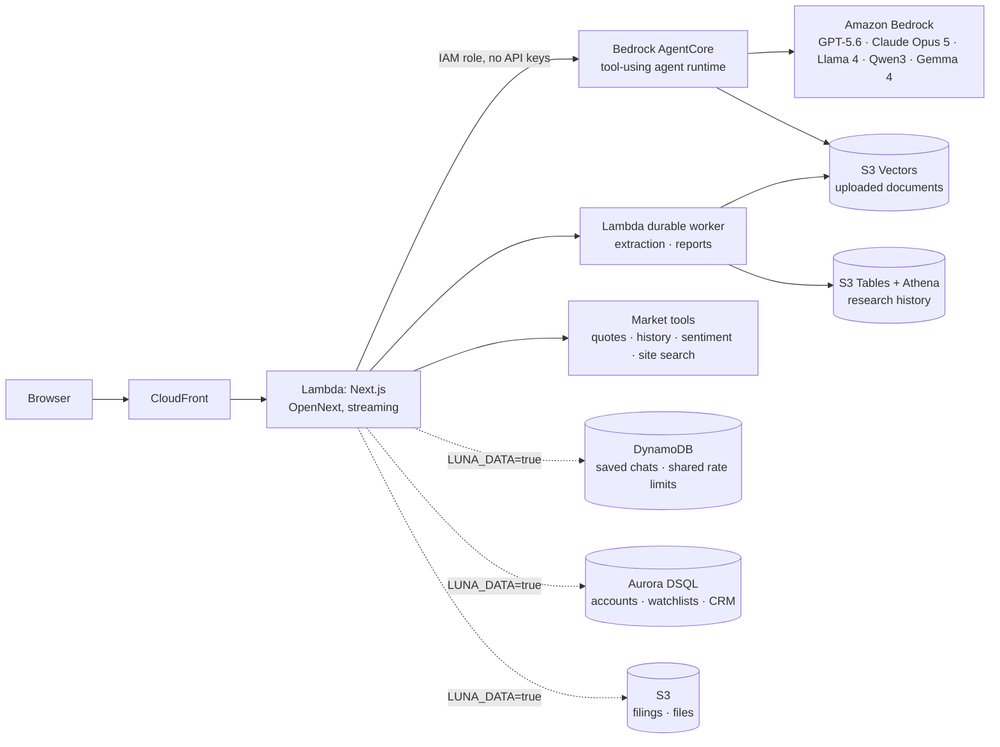

# Luna Terminal: demo and AWS story

A financial research terminal with AI at its center. The AI answers from live
market data instead of memory, and the whole stack runs serverless on AWS.

## Architecture

## Why each AWS service

| Service | What it does here | Why it fits |
|---|---|---|
| **Bedrock** | Five models behind one model picker, all calling the same market tools | One IAM role, no AI keys; choose the model per question |
| **Bedrock AgentCore** | Runs the chat's tool-using agent, per-user sessions, streamed answers | Managed agent runtime, IAM-only access |
| **S3 Vectors + Titan Embeddings** | Search uploaded documents by meaning, with cited chunks | Cheap vector storage, owner-filtered queries |
| **Bedrock Data Automation + Lambda durable functions** | Extract PDFs, images and audio; run background research reports | Checkpointed jobs with no idle compute |
| **S3 Tables (Iceberg) + Athena** | Searchable history of documents and reports | SQL over S3, owner-scoped |
| **Lambda + CloudFront** (via SST + OpenNext) | Hosts the Next.js app and streams answers | Scales to zero; the CDN caches public market pages |
| **DynamoDB** | Saved chats (sync across devices) and rate limits shared by all Lambdas | Key-value access, atomic counters, TTL expiry, no servers |
| **Aurora DSQL** | Accounts, watchlists, advisor CRM | Serverless Postgres with IAM auth: no password, no VPC |
| **S3** | Filing cache and files | Immutable documents, cheap storage |
| **CloudWatch** | Latency, tokens and errors per model (`LunaTerminal/AI` metrics), and one JSON log line per failure | Compare models on speed and cost; find causes in Logs Insights |
| **IAM** | The Lambda may call exactly the five models, nothing wider | Least privilege, visible in `sst.config.ts` |

Infrastructure is code (`sst.config.ts`). One `npx sst deploy` reproduces the
stack, and GitHub Actions can deploy over OIDC with no stored AWS keys.

## What makes the AI trustworthy

1. **Data before answers.** The first model turn must call a tool (quote,
   price history, sentiment, page search). An answer that skipped the data is
   withheld instead of shown.
2. **Live and dated.** Prices come from the tool results, with their dates.
3. **Same tools, any model.** GPT, Claude, Llama, Qwen and Gemma share one tool
   layer (`lib/awsChat.mjs`), so models can be compared fairly on the same
   question.
4. **Resilient.** A temporary AWS error is retried once. If one model is
   unavailable, a backup model answers and the user is told which one did.
   Failures show their real cause (credentials, access, throttling...).
5. **Fast.** Each question's tools run in parallel (in the site and in the
   AgentCore agent), and the answer streams.
6. **Governed (optional).** A Bedrock Guardrail can decline personal buy/sell
   advice for every model (`LUNA_GUARDRAIL=true`).

## Live demo (about 4 minutes): "the meeting is tomorrow morning"

Follows the deck's story (slide 2): an advisor must review a client's
statements, find what matters and bring recommendations to a meeting, and
time is running out. The client is the **Harper family**, a fictional packet in
`docs/demo/harper-family-q3-2026-review.pdf` (4 pages: profile, investment
report, studio income statement, household cash flow). It's planted with four
findings for Luna to surface:

- **Tech concentration:** NVDA, AAPL, MSFT and TSM are 52.7% of the
  portfolio.
- **Shared supply chain:** NVDA and TSM (28.5% together) depend on the same
  chips.
- **Shrinking margin:** the wife's studio grew revenue 10.6%, but net margin
  fell from 11.5% to 7.7%.
- **Tight liquidity:** $108k of renovation and tuition is due within 11
  months, against $88k cash plus about $26k of savings. That only just covers
  it, and if the studio's draw falls by a third the family is about $12k
  short.

Signed in, on `/dashboard/chat`, GPT-5.6 Sol (default model):

| # | Time | Do | Say |
|---|---|---|---|
| 1 | 0:20 | Show the dashboard briefly, then open the chat | "Every number Luna gives is pulled live and dated. It never answers from memory." |
| 2 | 0:40 | **Documents & research** → upload the Harper PDF (do it before the demo; see below) → select it → ask: *"Summarize this client packet: the key trends and what I should raise in the meeting."* | "This is the night-before review that used to take hours. The answer cites the page it came from." |
| 3 | 0:40 | Ask: *"How have NVDA and TSM moved over the last year, and what are they at today?"* | Point at the live prices, dates and charts. "Live data, next to the client's own statement." |
| 4 | 0:30 | Open `/supply-chain`, enter NVDA, and point at TSM ("fabricates Blackwell and Hopper GPUs") | "52.7% in tech, and the two biggest positions share one supply chain. That's the risk to raise." |
| 5 | 0:30 | Ask: *"Can the Harpers cover the renovation and tuition if the studio's draw falls by a third?"* | "It works the cash-flow page: about $12k short. That's a planning conversation, found the night before." |
| 6 | 0:20 | Ask: *"Should they sell their NVIDIA?"* | "Luna informs, it doesn't advise: it lays out the case each way and leaves the decision with the advisor. That's the compliance line." |
| 7 | 0:20 | Switch the model to **Claude Opus 5 · AWS** and re-ask question 3 | "Five models on Amazon Bedrock, one set of tools: pick the model per question." |
| 8 | 0:20 | Click **Research in background** on the packet, *"Prepare a one-page meeting brief for the Harpers"*, then move to the AWS slide while it runs | "Reports run as background jobs on AWS. The brief is ready when the meeting starts." |

Then the AWS slide (below), and **CloudWatch → Metrics → LunaTerminal/AI**
showing latency and tokens per model, if you have time.

Optional (30 s), for technical judges: in Claude Desktop with the
`/api/mcp` connector (docs/MCP.md), ask *"What's NVDA at, and where on Luna
can I see its supply chain?"* "Any AI agent can use Luna's tools; it's the
same tool code the AgentCore agent runs."

### Prepare before presenting

- Sign in on the demo browser. Upload the Harper PDF **before** the demo and
  wait for **ready**: extraction runs as a background job, so don't leave it
  to chance on stage. Then run questions 2-5 once, to check the answers and
  warm up the Lambdas.
- Keep a second tab with an answered chat as a fallback, and the backup
  recording ready.
- Zoom the browser to 125% so the room can read it.

### The AWS slide (for the deck)

The AWS judges rank "pick each service because your idea needs it, not to
fill a list" first. So the slide follows the demo: each service is tied to a
step the judges just watched.

**Title:** How it's built on AWS

| Demo step | AWS service | Why this one |
|---|---|---|
| Upload the client packet | **Bedrock Data Automation** + **Lambda durable functions** | Extracting text from PDFs is slow: a checkpointed background job keeps the chat responsive and resumes after a failure |
| "Summarize this packet" (cited pages) | **S3 Vectors** + **Titan embeddings** | Finds the right page by meaning; storage is cheap and every query is filtered to the owner's documents |
| Questions with live prices | **Bedrock AgentCore Runtime** + **Bedrock** models | A managed runtime for the tool-using agent; tools run in parallel; switch between 5 models with no code change |
| "Should they sell?" | System prompt; a **Bedrock Guardrail** is built behind a switch | It informs, it doesn't advise. Say the Guardrail is optional unless you turn it on for the demo |
| Signed in, history on any device | **Aurora DSQL** + **DynamoDB** | Serverless, IAM auth with no database password; atomic counters give rate limits shared by every Lambda |
| The site itself | **CloudFront + Lambda** (deployed with **SST**, infrastructure as code) | Scales to zero between uses; one command rebuilds it |

**Built right** (the footer, or say it aloud):
- **No hard-coded keys:** the Lambda's IAM role calls only the 5 models.
- **Graceful errors:** a failed call is retried, then a backup model answers, and the real cause is logged.
- **Measured:** CloudWatch records latency, tokens and errors for every model.

Leave out services the demo doesn't show (S3 Tables, MCP) unless asked.

### Workshop account rules that affect the demo

- **About 1 Bedrock call per second.** Ask one question at a time and let
  each answer finish. Don't run `smoke:site` or `check:bedrock` during the
  presentation. A throttled call falls back to the backup model, which
  still answers, just more slowly.
- **Made-up client data only.** The Harper packet is fictional and says so on
  every page. Prices come from public market quotes.
- **The account is deleted after the event.** Record the demo video
  beforehand; the rubric strongly recommends it anyway.

## Before presenting

- Deploy with `npm run deploy:aws` (it builds the AgentCore bundle first).
- Run `npm run smoke:site <url>` against the deployed URL. Every line should
  say OK.
- Run `npm run check:bedrock` with the demo credentials. Every model should
  say `OK`. If one fails, start the demo on a model that passed.
- If the AI shows "AWS rejected the server's credentials", the credentials
  have expired. Refresh them, or present from the deployed CloudFront URL,
  which uses the Lambda role and doesn't expire.
- Keep a screen recording of the full script as a backup in case the network
  fails.

## Deployed with the full data stack

Stage `data-test` (`LUNA_DATA=true`) runs everything in the workshop account:
DynamoDB, S3 and Aurora DSQL alongside the AI services. The DSQL migration
applied all 34 statements, and `npm run smoke:site` passed every check, with
all five models answering through AgentCore. Sign-up, the watchlist and
cross-device chat history still need a check in the browser before presenting.

## Next (post-hackathon)

- Ingest SEC 10-K risk factors into the S3 Vectors index, so "which companies
  mention supply-chain risk?" works without uploads.
- AgentCore Memory for long-term user preferences.
- Turn on the built switches after testing them: Bedrock Guardrails
  (`LUNA_GUARDRAIL`) and prompt caching (`BEDROCK_PROMPT_CACHE`).
- AgentCore Gateway in front of the MCP tools, with sign-in, so per-user tools
  can be exposed too (docs/MCP.md).
