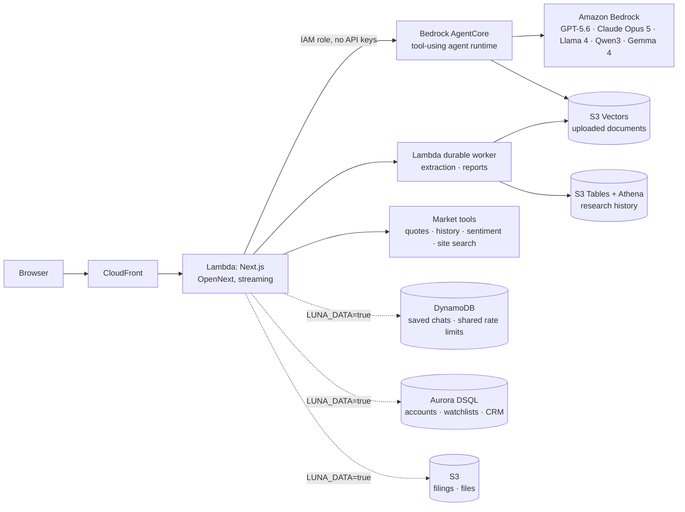

# Luna Terminal: demo and AWS story

A financial research terminal with AI at its center. The AI answers from live
market data instead of memory, and the whole stack runs serverless on AWS.

## Architecture

## Why each AWS service

| Service | What it does here | Why it fits |
|---|---|---|
| **Bedrock** | Five models behind one model picker, all calling the same market tools | One IAM role, no AI keys; choose the model per question |
| **Bedrock AgentCore** | Runs the chat's tool-using agent, per-user sessions, streamed answers | Managed agent runtime, IAM-only access |
| **S3 Vectors + Titan Embeddings** | Search uploaded documents by meaning, with cited chunks | Cheap vector storage, owner-filtered queries |
| **Bedrock Data Automation + Lambda durable functions** | Extract PDFs, images and audio; run background research reports | Checkpointed jobs with no idle compute |
| **S3 Tables (Iceberg) + Athena** | Searchable history of documents and reports | SQL over S3, owner-scoped |
| **Lambda + CloudFront** (via SST + OpenNext) | Hosts the Next.js app and streams answers | Scales to zero; the CDN caches public market pages |
| **DynamoDB** | Saved chats (sync across devices) and rate limits shared by all Lambdas | Key-value access, atomic counters, TTL expiry, no servers |
| **Aurora DSQL** | Accounts, watchlists, advisor CRM | Serverless Postgres with IAM auth: no password, no VPC |
| **S3** | Filing cache and files | Immutable documents, cheap storage |
| **CloudWatch** | Latency, tokens and errors per model (`LunaTerminal/AI` metrics), and one JSON log line per failure | Compare models on speed and cost; find causes in Logs Insights |
| **IAM** | The Lambda may call exactly the five models, nothing wider | Least privilege, visible in `sst.config.ts` |

Infrastructure is code (`sst.config.ts`). One `npx sst deploy` reproduces the
stack, and GitHub Actions can deploy over OIDC with no stored AWS keys.

## What makes the AI trustworthy

1. **Data before answers.** The first model turn must call a tool (quote,
   price history, sentiment, page search). An answer that skipped the data is
   withheld instead of shown.
2. **Live and dated.** Prices come from the tool results, with their dates.
3. **Same tools, any model.** GPT, Claude, Llama, Qwen and Gemma share one tool
   layer (`lib/awsChat.mjs`), so models can be compared fairly on the same
   question.
4. **Resilient.** A temporary AWS error is retried once. If one model is
   unavailable, a backup model answers and the user is told which one did.
   Failures show their real cause (credentials, access, throttling...).
5. **Fast.** Each question's tools run in parallel (in the site and in the
   AgentCore agent), and the answer streams.
6. **Governed (optional).** A Bedrock Guardrail can decline personal buy/sell
   advice for every model (`LUNA_GUARDRAIL=true`).

## 3-minute demo script

1. **Market context (30 s).** Open `/dashboard`: the sentiment gauge, movers
   and watchlist widgets.
2. **Ask the AI (60 s).** Open `/dashboard/chat` with GPT-5.6 Sol (default).
   - "Compare NVDA and SPY over the last year": watch the tool data arrive,
     then the streamed answer with dated numbers and stock charts.
   - Switch to **Claude Opus 5 · AWS** and ask "What is market sentiment
     today, and where can I explore it?" Same tools, different model.
   - "What is a P/E ratio?": a concept question needs no live data, and the
     model says so.
3. **Grounding (30 s).** Ask "What is AAPL trading at?" and point at the
   retrieval date. The model cannot invent the number.
4. **Research depth (30 s).** Follow a link to `/stock/NVDA`, then
   `/hedge-funds` for 13F holdings and `/supply-chain` for relationships.
5. **Documents (30 s).** In the chat, expand **Documents & research**, upload
   a PDF, wait for **ready**, select it and ask about it. The answer cites
   chunks. Or choose **Research in background** for a saved report.
6. **AWS view (30 s).** Show `sst.config.ts`: IAM scoped to five models, no
   keys. If deployed with `LUNA_DATA=true`, sign in on two browsers and show
   a chat saved on one appearing on the other.
7. **Luna as an MCP server (30 s).** In Claude Desktop (Settings → Connectors
   → add `https://<site>/api/mcp`), ask "What's NVDA at, and where on Luna can
   I see its supply chain?" Claude calls Luna's tools on AWS and links the
   page. Same tool code as the AgentCore agent, open to any MCP client
   (docs/MCP.md).

## Before presenting

- Deploy with `npm run deploy:aws` (it builds the AgentCore bundle first).
- Run `npm run smoke:site <url>` against the deployed URL. Every line should
  say OK.
- Run `npm run check:bedrock` with the demo credentials. Every model should
  say `OK`. If one fails, start the demo on a model that passed.
- If the AI shows "AWS rejected the server's credentials", the credentials
  have expired. Refresh them, or present from the deployed CloudFront URL,
  which uses the Lambda role and doesn't expire.
- Keep a screen recording of the full script as a backup in case the network
  fails.

## Deployed with the full data stack

Stage `data-test` (`LUNA_DATA=true`) runs everything in the workshop account:
DynamoDB, S3 and Aurora DSQL alongside the AI services. The DSQL migration
applied all 34 statements, and `npm run smoke:site` passed every check, with
all five models answering through AgentCore. Sign-up, the watchlist and
cross-device chat history still need a check in the browser before presenting.

## Next (post-hackathon)

- Ingest SEC 10-K risk factors into the S3 Vectors index, so "which companies
  mention supply-chain risk?" works without uploads.
- AgentCore Memory for long-term user preferences.
- Turn on the built switches after testing them: Bedrock Guardrails
  (`LUNA_GUARDRAIL`) and prompt caching (`BEDROCK_PROMPT_CACHE`).
- AgentCore Gateway in front of the MCP tools, with sign-in, so per-user tools
  can be exposed too (docs/MCP.md).
