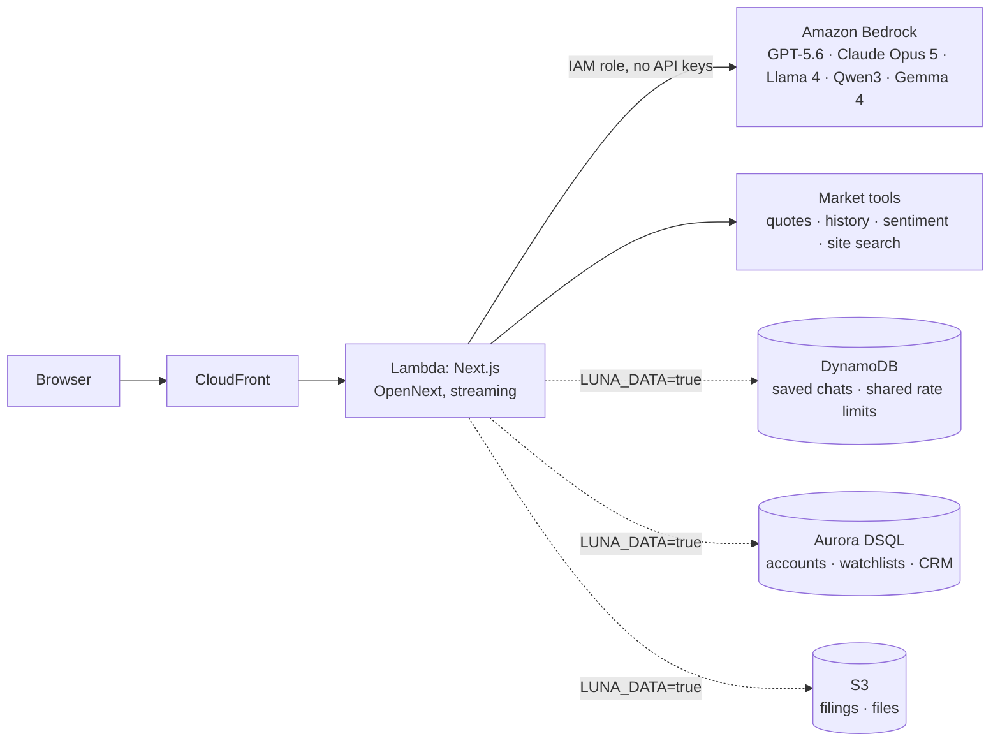

# Luna Terminal: demo and AWS story

A financial research terminal with AI at its center. The AI answers from live
market data instead of memory, and the whole stack runs serverless on AWS.

## Architecture

## Why each AWS service

| Service | What it does here | Why it fits |
|---|---|---|
| **Bedrock** | Five models behind one model picker, all calling the same market tools | One IAM role, no AI keys; choose the model per question |
| **Lambda + CloudFront** (via SST + OpenNext) | Hosts the Next.js app and streams answers | Scales to zero; the CDN caches public market pages |
| **DynamoDB** | Saved chats (sync across devices) and rate limits shared by all Lambdas | Key-value access, atomic counters, TTL expiry, no servers |
| **Aurora DSQL** | Accounts, watchlists, advisor CRM | Serverless Postgres with IAM auth: no password, no VPC |
| **S3** | Filing cache and files | Immutable documents, cheap storage |
| **CloudWatch** | One JSON log line per model failure (kind, model, region, request id) | Logs Insights can count failures by model |
| **IAM** | The Lambda may call exactly the five models, nothing wider | Least privilege, visible in `sst.config.ts` |

Infrastructure is code (`sst.config.ts`). One `npx sst deploy` reproduces the
stack, and GitHub Actions can deploy over OIDC with no stored AWS keys.

## What makes the AI trustworthy

1. **Data before answers.** The first model turn must call a tool (quote,
   price history, sentiment, page search). An answer that skipped the data is
   withheld instead of shown.
2. **Live and dated.** Prices come from the tool results, with their dates.
3. **Same tools, any model.** GPT, Claude, Llama, Qwen and Gemma share one tool
   layer (`lib/awsChat.mjs`), so models can be compared fairly on the same
   question.
4. **Resilient.** A temporary AWS error is retried once. If one model is
   unavailable, a backup model answers and the user is told which one did.
   Failures show their real cause (credentials, access, throttling...).
5. **Fast.** Each question's tools run in parallel, and the answer streams.

## 3-minute demo script

1. **Market context (30 s).** Open `/dashboard`: the sentiment gauge, movers
   and watchlist widgets.
2. **Ask the AI (60 s).** Open `/dashboard/chat` with GPT-5.6 Sol (default).
   - "Compare NVDA and SPY over the last year": watch the tool data arrive,
     then the streamed answer with dated numbers and stock charts.
   - Switch to **Claude Opus 5 · AWS** and ask "What is market sentiment
     today, and where can I explore it?" Same tools, different model.
   - "What is a P/E ratio?": a concept question needs no live data, and the
     model says so.
3. **Grounding (30 s).** Ask "What is AAPL trading at?" and point at the
   retrieval date. The model cannot invent the number.
4. **Research depth (30 s).** Follow a link to `/stock/NVDA`, then
   `/hedge-funds` for 13F holdings and `/supply-chain` for relationships.
5. **AWS view (30 s).** Show `sst.config.ts`: IAM scoped to five models, no
   keys. If deployed with `LUNA_DATA=true`, sign in on two browsers and show
   a chat saved on one appearing on the other.

## Before presenting

- Run `npm run check:bedrock` with the demo credentials. Every model should
  say `OK`. If one fails, start the demo on a model that passed.
- If the AI shows "AWS rejected the server's credentials", the credentials
  have expired. Refresh them, or present from the deployed CloudFront URL,
  which uses the Lambda role and doesn't expire.
- Keep a screen recording of the full script as a backup in case the network
  fails.

## Built and verified, not yet deployed

These are tested (with local databases and emulators) and deploy with
`LUNA_DATA=true`, but haven't run in the workshop account:
- Saved chats synced across devices: tested in two real browsers.
- Accounts on Aurora DSQL: the migration runner (`npm run db:migrate:dsql`)
  was tested on PostgreSQL 16 with DSQL's constraints.
- Shared rate limits on DynamoDB: tested with concurrent requests.

## Next (post-hackathon)

- **S3 Vectors + Bedrock Knowledge Base:** search company filings by meaning
  ("which companies mention supply-chain risk?"), with cited passages.
- **Bedrock AgentCore:** a research-report agent for multi-step tasks, with
  managed memory and tracing.
- Prompt caching, Bedrock Guardrails, per-model cost metrics in CloudWatch.
