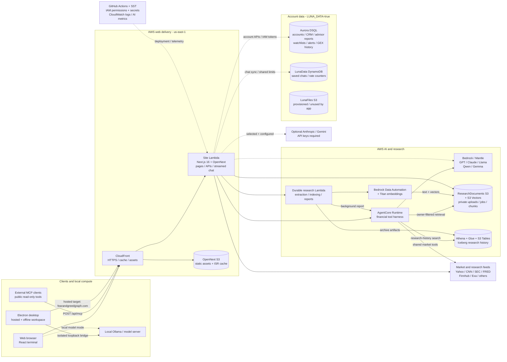
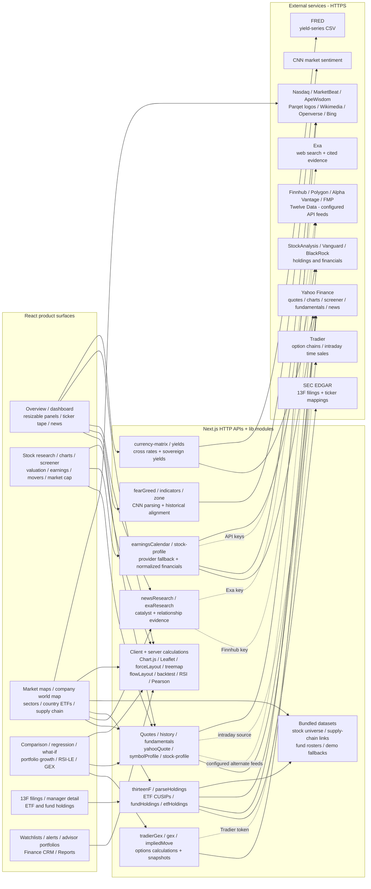
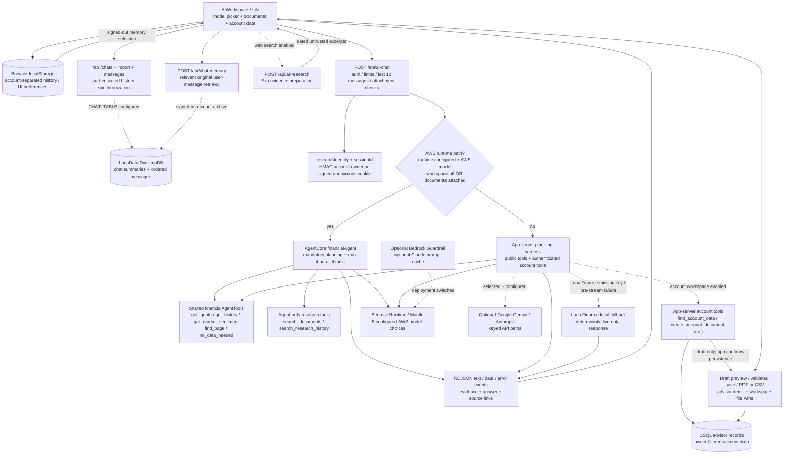
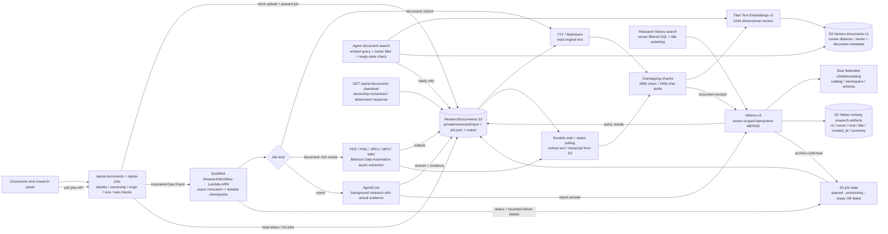
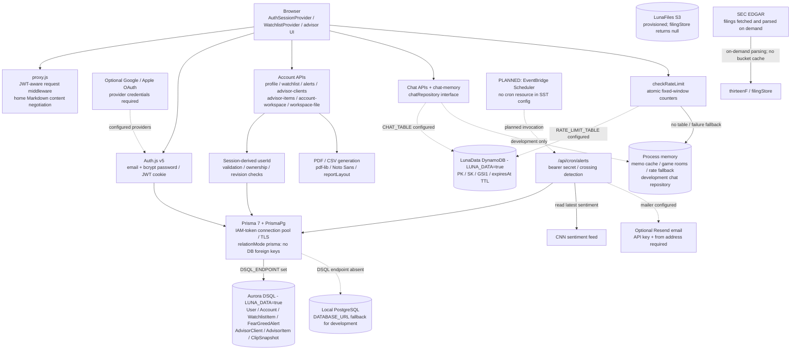
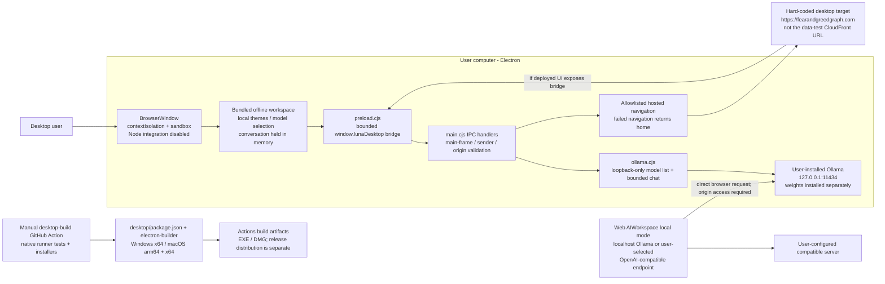
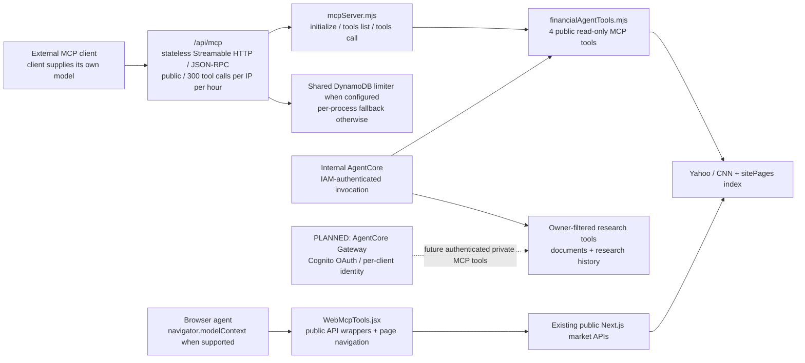

# Luna Terminal architecture

Source snapshot: **October 3, 2026 (America/Los_Angeles)**, based on `main` at `e332191`. This atlas describes the implemented repository, including configuration-gated paths. It is not a fresh AWS account inventory. Deployment status below is attributed to [HANDOFF.md](../HANDOFF.md); runtime connections are checked against source. Unrelated local dashboard edits are outside this documentation change.

Open [the diagram atlas](index.html) for all eight rendered views, [the overview image](overview.png) for a presentation, or [the architecture PDF](luna-terminal-architecture.pdf) for sharing. The Mermaid blocks below are the editable source; their SVG exports are in `diagrams/`.

**Reading key:** solid arrows represent implemented calls or data flow. Dashed arrows represent optional configuration, control-plane dependencies, or a planned connection, with the condition stated on the arrow. A node labeled **planned** is not implemented. A node labeled **provisioned / unused** exists in infrastructure code but has no current application read/write path. Arrows show the principal direction; HTTP responses and query results return along the same connection unless drawn separately.

## 1. Entire system




The desktop link identifies its configured hosted origin; this diagram does not assert that origin currently resolves to the workshop deployment. The unused files bucket has no runtime arrows. OpenNext also supplies ISR revalidation infrastructure (view 8).

The always-provisioned research stack is distinct from the `LUNA_DATA=true` data stack. Bedrock and DSQL use runtime IAM credentials, not static AI keys or a database password. Third-party credentials are SST secrets injected into environment variables. No secrets or credential values are included in this atlas.

## 2. Product, analytics and upstream data



Provider fallback order varies by endpoint; this diagram shows available integrations rather than claiming every request calls every provider. `FMP_API_KEY` has a supported path but is not one of the six keys reported configured in the handoff. Bundled/demo data is a separate source, not proof of a live feed. Cache layers are public HTTP cache headers, framework fetch caching where used, and per-process TTL/in-flight deduplication in `lib/memo.js`; there is no application Redis cache. Firecrawl is an operator troubleshooting tool for scraped upstream feeds, not a runtime dependency in this repository.

## 3. AI chat, tools and memory



AWS model IDs come from `lib/hostedModels.mjs`: `aws-gpt`, `aws-claude`, `aws-meta`, `aws-qwen`, `aws-gemma`. The manifest also offers `google-gemini` and `luna-finance`. Gemini deployment requires `ENABLE_GEMINI=true` and its SST secret; Luna Finance uses Anthropic when configured and a deterministic fallback otherwise.

The direct AWS path retries/fails over only before answer text is sent and discloses the answering model. The AgentCore path reports failures without switching models. Attached-document retrieval is enforced independently of the model's plan. Account workspace tools execute on the authenticated application server; when documents force the AgentCore path, account context is supplied as messages rather than exposing remote account tools. Chat-message retrieval is application memory logic, not the planned AgentCore Memory service. The browser sends recent conversation context; the agent does not independently load the complete conversation by ID.

## 4. Document ingestion and asynchronous research



Uploads are limited to 4 MB, extracted text to 180 KB, and selected documents to eight. Retrieval returns up to six chunks. The durable worker has a two-hour execution limit, 30-minute extraction polling budget, reserved concurrency of two, and seven-day durable execution retention. Athena scans are capped at 100 MB per query. Research data is owner-scoped; account ownership and signed anonymous-cookie ownership are separate. There is no document deletion UI or automatic SEC/13F ingestion into this research index. S3 Tables archives research artifacts, not the market-data time-series database.

## 5. Accounts, persistence and alerts



Profile avatars currently remain validated image data URIs in `User.image`, not S3 objects. `ClipSnapshot` is actively reused for GEX history; its old clip-bot comment does not establish an active clip service. Forum tables are retained legacy data with no forum pages/APIs. `ApiKey`, `Session`, and `VerificationToken` are schema/adapter structures, not evidence of an active API-key product, database-backed sessions, or email verification: sessions use JWT and verification is still planned. Without `CHAT_TABLE`, production chat APIs return 503 and the client keeps browser history. Without a DSQL endpoint or local database URL, account persistence is unavailable. Per-instance cache and game-room state are not durable across Lambdas.

## 6. Desktop and local model execution



The packaged local workspace has no independent live market tools and no automatic cloud fallback. The web workspace can first supply account records or Exa excerpts to its local model mode. The desktop starts on its bundled home page, not the hosted dashboard. There is no auto-update service. The desktop README describes release-download distribution, but the current AWS deploy workflow does not download installer release assets; that connection is not shown as implemented.

## 7. Agent interfaces and trust boundaries



HTTP MCP and browser WebMCP are different interfaces. Public HTTP MCP exposes only `get_quote`, `get_history`, `get_market_sentiment`, and `find_page`; it makes no model call and exposes no account data, chats, uploads, or private history. The internal harness additionally supports `no_data_needed` and its private research tools. Browser WebMCP registration is capability-detected and wraps existing public APIs. AgentCore Gateway, Cognito, and AgentCore Memory are roadmap items, not provisioned resources.

## 8. Build, deployment and observability

```mermaid
flowchart LR
  source["GitHub Darthh/Luna-LPL11<br/>main / pull requests"]
  ci["Web CI - Node 22<br/>npm ci - lint - offline tests - Next build"]
  trigger["Deploy workflow<br/>successful main push CI / v tag / manual stage"]
  gate["Configuration gates<br/>AWS_DEPLOY_ROLE_ARN required<br/>data-test / production require LUNA_DATA=true"]
  oidc["GitHub OIDC - STS<br/>assume configured deploy role"]
  agentbuild["build-agent.mjs / esbuild<br/>AgentCore Node bundle"]
  sst["SST v4 / Pulumi + CloudFormation<br/>sst.config.ts + infra/research.ts"]
  open["build-aws.mjs - OpenNext<br/>streaming wrapper + runtime preparation"]
  stack["Site + AI / research infrastructure<br/>optional data / guardrail / custom domain"]
  deploy["Deploy exact CI head SHA<br/>production retain/protect behavior"]
  smoke["smoke:site deployed URL<br/>pages / APIs / MCP / 5 AWS chat models"]
  deep["smoke:agent separate verification<br/>uploads / grounding / isolation / reports / archive"]
  secrets["SST secrets in SSM<br/>runtime env injection<br/>local development: ignored .env.local"]
  iam["Scoped execution roles<br/>models / S3 / vectors / Athena / AgentCore / DSQL"]
  logs["CloudWatch Logs<br/>structured AWS failure classification"]
  metrics["Embedded Metric Format<br/>LunaTerminal/AI by Model + Stage<br/>latency / tokens / cache reads / errors"]
  manual["Manual laptop deploy<br/>existing authenticated AWS profile"]
  cache[("OpenNext S3 assets + incremental cache")]
  tags[("OpenNext DynamoDB tag cache<br/>separate from LunaData")]
  queue["OpenNext SQS FIFO revalidation queue"]
  revalidate["OpenNext revalidation Lambda<br/>framework-managed ISR"]
  planned["PLANNED observability / operations<br/>X-Ray / WAF / budgets alarm<br/>CloudWatch dashboard / alert scheduler"]
  source --> ci
  ci -->|"successful main push"| trigger
  source -->|"tag / manual"| trigger
  trigger --> gate
  gate -.->|"configured; otherwise workflow skipped"| oidc
  oidc --> agentbuild
  agentbuild --> sst
  manual --> agentbuild
  sst --> open
  open --> deploy
  sst --> stack
  deploy --> stack
  stack --> cache
  stack --> tags
  stack --> queue
  queue --> revalidate
  revalidate -->|"revalidate through site"| stack
  stack --> smoke
  stack --> deep
  secrets -.->|"deployment resolves env values"| stack
  iam -.->|"runtime authorization"| stack
  stack --> logs
  logs --> metrics
  planned -.->|"future infrastructure"| stack
```



OpenNext supporting infrastructure is verified against the installed SST Nextjs component: S3 `_assets` / `_cache`, a separate DynamoDB tag table, an SQS FIFO revalidation queue, and its subscriber Lambda are created when the OpenNext output enables those defaults. The project does not disable incremental/tag caching. Exact generated resources depend on the build output; these are framework defaults, not a live account enumeration. Image optimization is disabled in `next.config.mjs`; no active image-optimizer path is shown. The infrastructure also includes Lambda IAM roles, permissions, and CloudWatch logging; no warmer is configured.

This diagram describes the workflow's implementation, not whether repository variables and the deploy role are currently configured. The handoff reports those prerequisites still need setup. It reports the `data-test` full-app deployment at `https://d2wyrxhbmhmu6j.cloudfront.net` on October 3 with 18/18 site smoke checks; account browser flows and cross-browser chat sync still need manual verification. `agents` is the AI/research preview. These are repository-reported observations, not newly run live checks. No deploy, cloud mutation, or AWS Organization operation is part of this atlas task.

## Source index

| Area | Source of truth |
|---|---|
| Deployment topology and switches | [sst.config.ts](../../sst.config.ts), [infra/research.ts](../../infra/research.ts), [open-next.config.ts](../../open-next.config.ts), [next.config.mjs](../../next.config.mjs) |
| Runtime status and operational caveats | [HANDOFF.md](../HANDOFF.md), [DEPLOY.md](../DEPLOY.md), [AWS_AGENT_RESEARCH.md](../AWS_AGENT_RESEARCH.md) |
| Web shell and product navigation | [app/layout.js](../../app/layout.js), [navigation.jsx](../../lib/navigation.jsx), [DashboardProvider.jsx](../../components/DashboardProvider.jsx), [sitePages.js](../../lib/sitePages.js) |
| Accounts and storage | [auth.js](../../auth.js), [auth.config.js](../../auth.config.js), [proxy.js](../../proxy.js), [schema.prisma](../../prisma/schema.prisma), [prisma.js](../../lib/prisma.js), [migrations](../../migrations) |
| Chat router and model routing | [ai-chat route](../../app/api/ai-chat/route.js), [AIWorkspace.jsx](../../components/AIWorkspace.jsx), [hostedModels.mjs](../../lib/hostedModels.mjs), [awsChat.mjs](../../lib/awsChat.mjs), [awsErrors.mjs](../../lib/awsErrors.mjs) |
| Agent runtime and shared tools | [entry.mjs](../../services/agentcore/entry.mjs), [server.mjs](../../services/agentcore/server.mjs), [financialAgent.mjs](../../lib/financialAgent.mjs), [financialAgentTools.mjs](../../lib/financialAgentTools.mjs), [agentCoreClient.mjs](../../lib/agentCoreClient.mjs) |
| Research ownership and processing | [agentIdentity.mjs](../../lib/agentIdentity.mjs), [agentResearch.mjs](../../lib/agentResearch.mjs), [workflow.mjs](../../services/research/workflow.mjs), [researchApi.mjs](../../lib/researchApi.mjs) |
| History and application memory | [chatHistory.js](../../lib/chatHistory.js), [chatRepository.mjs](../../lib/chatRepository.mjs), [chatMemory.mjs](../../lib/chatMemory.mjs), [accountChatMemory.mjs](../../lib/accountChatMemory.mjs) |
| Advisor data and exports | [financeCrmApi.mjs](../../lib/financeCrmApi.mjs), [advisorItems.mjs](../../lib/advisorItems.mjs), [accountWorkspace.mjs](../../lib/accountWorkspace.mjs), [workspaceFiles.mjs](../../lib/workspaceFiles.mjs), [reportLayout.mjs](../../lib/reportLayout.mjs) |
| Cache, quotas, filing and alerts | [memo.js](../../lib/memo.js), [rateLimit.js](../../lib/rateLimit.js), [filingStore.js](../../lib/filingStore.js), [alerts cron](../../app/api/cron/alerts/route.js), [sendEmail.js](../../lib/sendEmail.js) |
| HTTP MCP and WebMCP | [mcpServer.mjs](../../lib/mcpServer.mjs), [mcp route](../../app/api/mcp/route.js), [WebMcpTools.jsx](../../components/WebMcpTools.jsx), [MCP.md](../MCP.md) |
| Desktop and local AI | [desktop/main.cjs](../../desktop/main.cjs), [preload.cjs](../../desktop/preload.cjs), [ollama.cjs](../../desktop/ollama.cjs), [ollamaClient.mjs](../../lib/ollamaClient.mjs) |
| CI and operational evidence | [web-ci.yml](../../.github/workflows/web-ci.yml), [deploy.yml](../../.github/workflows/deploy.yml), [desktop-build.yml](../../.github/workflows/desktop-build.yml), [modelMetrics.mjs](../../lib/modelMetrics.mjs), [smoke-site.mjs](../../scripts/smoke-site.mjs), [smoke-agent.mjs](../../scripts/smoke-agent.mjs) |

## Complete route inventory

The following lists every tracked App Router page and HTTP route in this snapshot. Route groups such as `(legal)` are removed from public paths. Dynamic bracket segments are retained. Redirect aliases in `next.config.mjs` do not create additional pages; notably `/hedge-funds` redirects to `/13Filings`. Endpoint existence does not mean authentication, external feeds, or persistence are configured.

<!-- ROUTE_INVENTORY -->

**40 page entry points and 58 HTTP route handlers.**

| Page | Source |
|---|---|
| `/about` | [app/(legal)/about/page.js](../../app/(legal)/about/page.js) |
| `/accessibility` | [app/(legal)/accessibility/page.js](../../app/(legal)/accessibility/page.js) |
| `/contact` | [app/(legal)/contact/page.js](../../app/(legal)/contact/page.js) |
| `/privacy` | [app/(legal)/privacy/page.js](../../app/(legal)/privacy/page.js) |
| `/terms` | [app/(legal)/terms/page.js](../../app/(legal)/terms/page.js) |
| `/13Filings/[cik]` | [app/13Filings/[cik]/page.js](../../app/13Filings/[cik]/page.js) |
| `/13Filings` | [app/13Filings/page.js](../../app/13Filings/page.js) |
| `/ai-bot` | [app/ai-bot/page.js](../../app/ai-bot/page.js) |
| `/alerts` | [app/alerts/page.js](../../app/alerts/page.js) |
| `/chart-metrics` | [app/chart-metrics/page.js](../../app/chart-metrics/page.js) |
| `/client-portfolios` | [app/client-portfolios/page.js](../../app/client-portfolios/page.js) |
| `/company-world-map` | [app/company-world-map/page.js](../../app/company-world-map/page.js) |
| `/country-etfs` | [app/country-etfs/page.js](../../app/country-etfs/page.js) |
| `/currencies` | [app/currencies/page.js](../../app/currencies/page.js) |
| `/dashboard/chat/[id]` | [app/dashboard/chat/[id]/page.js](../../app/dashboard/chat/[id]/page.js) |
| `/dashboard/chat` | [app/dashboard/chat/page.js](../../app/dashboard/chat/page.js) |
| `/dashboard` | [app/dashboard/page.js](../../app/dashboard/page.js) |
| `/earnings-calendar` | [app/earnings-calendar/page.js](../../app/earnings-calendar/page.js) |
| `/finance-crm` | [app/finance-crm/page.js](../../app/finance-crm/page.js) |
| `/font-preview` | [app/font-preview/page.js](../../app/font-preview/page.js) |
| `/global-markets` | [app/global-markets/page.js](../../app/global-markets/page.js) |
| `/global-yields` | [app/global-yields/page.js](../../app/global-yields/page.js) |
| `/graphs/comparison` | [app/graphs/comparison/page.js](../../app/graphs/comparison/page.js) |
| `/graphs/historical` | [app/graphs/historical/page.js](../../app/graphs/historical/page.js) |
| `/lots-of-charts` | [app/lots-of-charts/page.js](../../app/lots-of-charts/page.js) |
| `/maps` | [app/maps/page.js](../../app/maps/page.js) |
| `/market-cap` | [app/market-cap/page.js](../../app/market-cap/page.js) |
| `/market-movers` | [app/market-movers/page.js](../../app/market-movers/page.js) |
| `/model-portfolios` | [app/model-portfolios/page.js](../../app/model-portfolios/page.js) |
| `/` | [app/page.js](../../app/page.js) |
| `/portfolio-comparison` | [app/portfolio-comparison/page.js](../../app/portfolio-comparison/page.js) |
| `/regression-analysis` | [app/regression-analysis/page.js](../../app/regression-analysis/page.js) |
| `/reports` | [app/reports/page.js](../../app/reports/page.js) |
| `/rsi-le` | [app/rsi-le/page.js](../../app/rsi-le/page.js) |
| `/screener` | [app/screener/page.js](../../app/screener/page.js) |
| `/stock/[symbol]` | [app/stock/[symbol]/page.js](../../app/stock/[symbol]/page.js) |
| `/supply-chain` | [app/supply-chain/page.js](../../app/supply-chain/page.js) |
| `/us-sectors` | [app/us-sectors/page.js](../../app/us-sectors/page.js) |
| `/watchlist` | [app/watchlist/page.js](../../app/watchlist/page.js) |
| `/what-if` | [app/what-if/page.js](../../app/what-if/page.js) |

| HTTP path | Exported methods | Source |
|---|---|---|
| `/api/account-workspace` | POST | [app/api/account-workspace/route.js](../../app/api/account-workspace/route.js) |
| `/api/advisor-clients` | DELETE, GET, POST, PUT | [app/api/advisor-clients/route.js](../../app/api/advisor-clients/route.js) |
| `/api/advisor-items` | DELETE, GET, POST, PUT | [app/api/advisor-items/route.js](../../app/api/advisor-items/route.js) |
| `/api/ai-chat` | POST | [app/api/ai-chat/route.js](../../app/api/ai-chat/route.js) |
| `/api/ai-documents` | GET, POST | [app/api/ai-documents/route.js](../../app/api/ai-documents/route.js) |
| `/api/ai-jobs` | POST | [app/api/ai-jobs/route.js](../../app/api/ai-jobs/route.js) |
| `/api/ai-research` | POST | [app/api/ai-research/route.js](../../app/api/ai-research/route.js) |
| `/api/alerts` | DELETE, GET, POST | [app/api/alerts/route.js](../../app/api/alerts/route.js) |
| `/api/auth/[...nextauth]` | GET, POST | [app/api/auth/[...nextauth]/route.js](../../app/api/auth/[...nextauth]/route.js) |
| `/api/auth/register` | POST | [app/api/auth/register/route.js](../../app/api/auth/register/route.js) |
| `/api/chart-metrics` | GET | [app/api/chart-metrics/route.js](../../app/api/chart-metrics/route.js) |
| `/api/chat-memory` | POST | [app/api/chat-memory/route.js](../../app/api/chat-memory/route.js) |
| `/api/chats/[id]/messages` | POST | [app/api/chats/[id]/messages/route.js](../../app/api/chats/[id]/messages/route.js) |
| `/api/chats/[id]` | DELETE, GET, PATCH | [app/api/chats/[id]/route.js](../../app/api/chats/[id]/route.js) |
| `/api/chats/import` | POST | [app/api/chats/import/route.js](../../app/api/chats/import/route.js) |
| `/api/chats` | GET | [app/api/chats/route.js](../../app/api/chats/route.js) |
| `/api/company-hq-photo` | GET | [app/api/company-hq-photo/route.js](../../app/api/company-hq-photo/route.js) |
| `/api/company-world-map` | GET | [app/api/company-world-map/route.js](../../app/api/company-world-map/route.js) |
| `/api/cron/alerts` | GET | [app/api/cron/alerts/route.js](../../app/api/cron/alerts/route.js) |
| `/api/currency-matrix` | GET | [app/api/currency-matrix/route.js](../../app/api/currency-matrix/route.js) |
| `/api/earnings-calendar` | GET | [app/api/earnings-calendar/route.js](../../app/api/earnings-calendar/route.js) |
| `/api/etf-holdings` | GET | [app/api/etf-holdings/route.js](../../app/api/etf-holdings/route.js) |
| `/api/event-news` | GET | [app/api/event-news/route.js](../../app/api/event-news/route.js) |
| `/api/fear-greed/csv` | GET | [app/api/fear-greed/csv/route.js](../../app/api/fear-greed/csv/route.js) |
| `/api/fear-greed` | GET | [app/api/fear-greed/route.js](../../app/api/fear-greed/route.js) |
| `/api/game-room` | GET, POST | [app/api/game-room/route.js](../../app/api/game-room/route.js) |
| `/api/gate` | GET, POST | [app/api/gate/route.js](../../app/api/gate/route.js) |
| `/api/hedge-funds` | GET | [app/api/hedge-funds/route.js](../../app/api/hedge-funds/route.js) |
| `/api/implied-move` | GET | [app/api/implied-move/route.js](../../app/api/implied-move/route.js) |
| `/api/index-movers` | GET | [app/api/index-movers/route.js](../../app/api/index-movers/route.js) |
| `/api/logo` | GET | [app/api/logo/route.js](../../app/api/logo/route.js) |
| `/api/market-cap-ranking` | GET | [app/api/market-cap-ranking/route.js](../../app/api/market-cap-ranking/route.js) |
| `/api/market-news` | GET | [app/api/market-news/route.js](../../app/api/market-news/route.js) |
| `/api/mcp` | GET, OPTIONS, POST | [app/api/mcp/route.js](../../app/api/mcp/route.js) |
| `/api/popular-stocks` | GET | [app/api/popular-stocks/route.js](../../app/api/popular-stocks/route.js) |
| `/api/portfolio-performance` | POST | [app/api/portfolio-performance/route.js](../../app/api/portfolio-performance/route.js) |
| `/api/prices` | GET | [app/api/prices/route.js](../../app/api/prices/route.js) |
| `/api/profile` | GET, PATCH | [app/api/profile/route.js](../../app/api/profile/route.js) |
| `/api/research/catalysts` | GET | [app/api/research/catalysts/route.js](../../app/api/research/catalysts/route.js) |
| `/api/research/supply-chain` | GET | [app/api/research/supply-chain/route.js](../../app/api/research/supply-chain/route.js) |
| `/api/screener` | GET | [app/api/screener/route.js](../../app/api/screener/route.js) |
| `/api/spy-gex/change` | POST | [app/api/spy-gex/change/route.js](../../app/api/spy-gex/change/route.js) |
| `/api/spy-gex/history` | GET, POST | [app/api/spy-gex/history/route.js](../../app/api/spy-gex/history/route.js) |
| `/api/spy-gex` | GET | [app/api/spy-gex/route.js](../../app/api/spy-gex/route.js) |
| `/api/stock-chart` | GET | [app/api/stock-chart/route.js](../../app/api/stock-chart/route.js) |
| `/api/stock-map` | GET | [app/api/stock-map/route.js](../../app/api/stock-map/route.js) |
| `/api/stock-profile` | GET | [app/api/stock-profile/route.js](../../app/api/stock-profile/route.js) |
| `/api/stock-search` | GET | [app/api/stock-search/route.js](../../app/api/stock-search/route.js) |
| `/api/ticker-tape` | GET | [app/api/ticker-tape/route.js](../../app/api/ticker-tape/route.js) |
| `/api/valuation-compare` | GET | [app/api/valuation-compare/route.js](../../app/api/valuation-compare/route.js) |
| `/api/valuation-history` | GET | [app/api/valuation-history/route.js](../../app/api/valuation-history/route.js) |
| `/api/volume-stocks` | GET | [app/api/volume-stocks/route.js](../../app/api/volume-stocks/route.js) |
| `/api/watchlist-meta` | GET | [app/api/watchlist-meta/route.js](../../app/api/watchlist-meta/route.js) |
| `/api/watchlist-quotes` | GET | [app/api/watchlist-quotes/route.js](../../app/api/watchlist-quotes/route.js) |
| `/api/watchlist` | DELETE, GET, PATCH, POST, PUT | [app/api/watchlist/route.js](../../app/api/watchlist/route.js) |
| `/api/workspace-file` | POST | [app/api/workspace-file/route.js](../../app/api/workspace-file/route.js) |
| `/api/yields` | GET | [app/api/yields/route.js](../../app/api/yields/route.js) |
| `/index.md` | GET | [app/index.md/route.js](../../app/index.md/route.js) |

<!-- END_ROUTE_INVENTORY -->
## Regenerating the diagrams

Use Node 22 and a local Chrome installation (or set `ARCHITECTURE_BROWSER` to another Chromium executable). No application dependency changes are needed. The renderer uses Mermaid CLI 12.0.0 through `npm exec` and the existing `pdf-lib` dependency:

```powershell
node docs/architecture/render.mjs
```

The renderer regenerates the tracked route inventory, eight numbered SVGs, overview PNG, eight-page PDF, and offline HTML atlas. Temporary renderer inputs and intermediate PDFs go into a task-owned system temporary directory. Numbered exports correspond to the eight headings above. Keep exported views synchronized after editing their Mermaid source. The source snapshot label is deliberate: update it when reviewing a newer repository revision.
